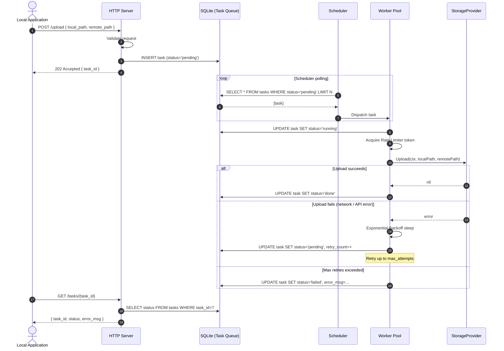

# Architecture & Data Flow

The architectural principle of Tardis is **"Zero latency for the caller, zero state loss on shutdown."** The HTTP API returns immediately; all cloud I/O happens asynchronously in the background; all state is persisted to SQLite before any acknowledgement is sent.

---

## 1. Component Overview

```
┌─────────────────────────────────────────────────────────────────┐
│                        Tardis Process                           │
│                                                                 │
│  ┌──────────────┐    ┌───────────────┐    ┌─────────────────┐  │
│  │  HTTP Server  │───▶│  Task Queue   │◀───│   Scheduler     │  │
│  │  (API Layer)  │    │  (SQLite DB)  │    │  (Goroutine)    │  │
│  └──────────────┘    └───────────────┘    └────────┬────────┘  │
│                       ┌───────────────┐            │           │
│                       │  Path Cache   │            ▼           │
│                       │  (SQLite DB)  │   ┌─────────────────┐  │
│                       └───────────────┘   │  Worker Pool    │  │
│                                           │  (N Goroutines) │  │
│                                           └────────┬────────┘  │
│                                                    │           │
│                                           ┌────────▼────────┐  │
│                                           │ StorageProvider │  │
│                                           │  (Interface)    │  │
│                                           └────────┬────────┘  │
└────────────────────────────────────────────────────┼───────────┘
                                                     │
                                            ┌────────▼────────┐
                                            │  Cloud Storage  │
                                            │ (Google Drive)  │
                                            └─────────────────┘
```

---

## 2. Component Responsibilities

### 2.1. HTTP Server (API Layer)

- Receives upload/prefetch-download requests from the local application.
- Validates request format and payload.
- Writes a new **Task** record to the **Task Queue** (SQLite) atomically.
- Returns `202 Accepted` with a `task_id` immediately — **never** waits for cloud I/O.
- Exposes a status query endpoint `GET /tasks/{task_id}` for callers to poll Task progress.

**Must never:** block on network I/O, call the Storage Provider directly, or return `200 OK` before writing to SQLite.

---

### 2.2. Task Queue (SQLite — `tasks` table)

- Single source of truth for all pending, running, and completed Tasks.
- Schema (preliminary — subject to `/grill-me` resolution):

```sql
CREATE TABLE tasks (
    task_id     TEXT PRIMARY KEY,
    type        TEXT NOT NULL,          -- 'upload' | 'download'
    local_path  TEXT NOT NULL,
    remote_path TEXT NOT NULL,
    status      TEXT NOT NULL DEFAULT 'pending', -- 'pending'|'running'|'done'|'failed'
    retry_count INTEGER NOT NULL DEFAULT 0,
    error_msg   TEXT,
    created_at  DATETIME NOT NULL DEFAULT CURRENT_TIMESTAMP,
    updated_at  DATETIME NOT NULL DEFAULT CURRENT_TIMESTAMP
);
```

> [!IMPORTANT]
> Schema changes require a `/grill-me` session before implementation. Never alter the schema without documenting the migration strategy.

---

### 2.3. Path Cache (SQLite — `path_cache` table)

- Maps human-readable remote path strings to cloud-native object IDs.
- Used by the `GoogleDriveAdapter` to avoid repeated folder traversal API calls.
- Preliminary schema:

```sql
CREATE TABLE path_cache (
    path        TEXT PRIMARY KEY,
    object_id   TEXT NOT NULL,
    cached_at   DATETIME NOT NULL DEFAULT CURRENT_TIMESTAMP
);
```

---

### 2.4. Scheduler

- A single long-running Goroutine that monitors the Task Queue for `pending` Tasks.
- Dispatches Tasks to the Worker Pool.

> [!NOTE]
> The exact dispatch mechanism (push via channel vs. Worker polling SQLite directly) is an **open design decision**. Invoke `/grill-me` before implementing the Scheduler.

---

### 2.5. Worker Pool

- `N` long-lived Goroutines, where `N = workers.pool_size` from `tardis.yml`.
- Each Worker:
  1. Acquires a Task from the Scheduler (or polls the queue — TBD).
  2. Updates Task `status` to `running` in SQLite.
  3. Acquires a Rate Limiter token before each API call.
  4. Calls the `StorageProvider` interface methods to execute the upload or download.
  5. On success: updates Task `status` to `done`.
  6. On failure: applies Exponential Backoff, increments `retry_count`, resets `status` to `pending` (or `failed` if `retry_count >= max_attempts`).

---

### 2.6. StorageProvider Interface

```go
// StorageProvider defines the contract for all cloud storage backends.
// All Worker Pool code interacts with cloud storage exclusively via this interface.
type StorageProvider interface {
    Upload(ctx context.Context, localPath, remotePath string) error
    Download(ctx context.Context, remotePath, localPath string) error
    GetPathID(ctx context.Context, path string) (string, error)
}
```

- Workers must only call this interface. No concrete adapter types may appear in Worker Pool code.

---

## 3. Request Lifecycle (Upload)



---

## 4. Graceful Shutdown Sequence

```
SIGTERM received
    │
    ├─ HTTP Server: stop accepting new requests
    │
    ├─ Scheduler: stop dispatching new Tasks
    │
    ├─ Worker Pool: complete current in-progress chunk transfer
    │   (do NOT abandon mid-chunk)
    │
    ├─ SQLite: flush all pending writes, close connection
    │
    └─ Process exits (exit code 0)
```

> [!CAUTION]
> The process must not exit until the SQLite connection is closed cleanly. Any Tasks that were `running` at shutdown will be reset to `pending` on the **next** startup to prevent permanent loss.

---

## 5. Open Design Questions (Invoke `/grill-me`)

| Component | Open Question |
|---|---|
| **Scheduler dispatch** | Push channel from Scheduler to Workers, or Workers poll SQLite themselves? |
| **Startup recovery** | Should `running` tasks be auto-reset to `pending` on startup? |
| **Status endpoint schema** | Exact JSON response for `GET /tasks/{task_id}`? |
| **Prefetch API contract** | Exact request/response schema for background download requests? |
| **Chunked download** | Should downloads also use chunked transfer, or stream directly to disk? |

---

## 6. Next Documents

- [RULES.md — Session Rules](../RULES.md)
- [Project Overview (01_project_overview.md)](./01_project_overview.md)
- [Terminology & Concepts (02_terminology.md)](./02_terminology.md)
- [Go Coding Convention (04_go_convention.md)](./04_go_convention.md)
- [Git & General Convention (05_convention.md)](./05_convention.md)
